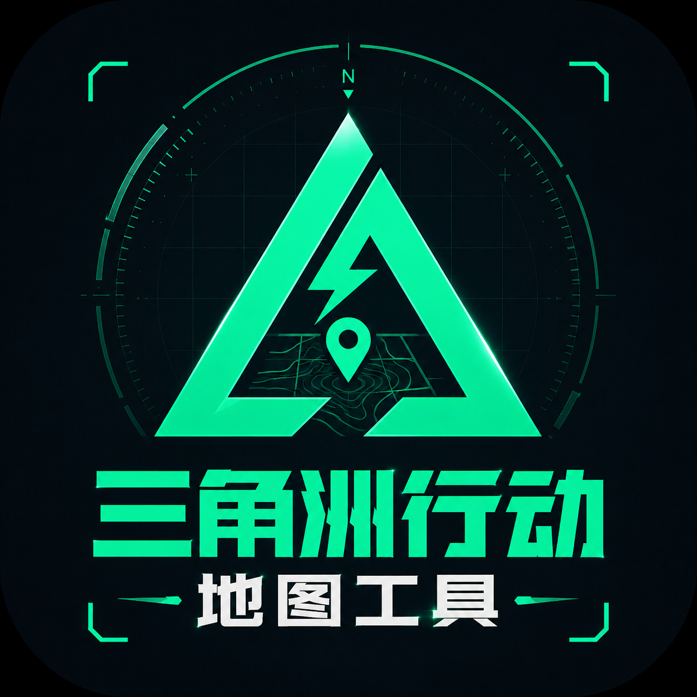

<div align="center">
  
  <h1>三角洲战术地图</h1>
  <p>面向《三角洲行动》全面战场的地图标注、兵棋推演与战术方案编辑工具。</p>
</div>

> 本项目是非官方社区工具，与腾讯、琳琅天上及《三角洲行动》官方无隶属或合作关系。

## 项目简介

三角洲战术地图将地图信息、阶段据点、兵棋部署、行动路线和战术标注集中到一个工作台中，适用于战前规划、队伍分工、战术复盘和自定义模式配置。

项目支持浏览器、Windows 桌面端和 Android 横屏端。正式版不依赖后端服务，编辑状态和战术方案默认保存在本地。

## 主要功能

- 支持 11 张全面战场地图，以及 PC 端和移动端游戏地图数据切换。
- 展示阶段、据点、防线、复活点、活动区域、地图道具、部署载具和刷新载具。
- 支持攻方与守方独立查看，并按阶段、回合保存战术部署。
- 提供画笔、直线、箭头、防线、矩形、圆形、文字、套索和橡皮擦。
- 支持图形移动、缩放、旋转、顶点编辑、曲线调整、样式修改和绘图锁。
- 提供地图指南针，可旋转地图视角并让地图元素同步跟随。
- 支持单兵、队伍、载具和建筑兵棋，以及阵地支援和干员技能标注。
- 支持兵棋阵营、队伍、状态、协同关系、行动路线和枪线。
- 提供机动、进攻、侦察、迂回、撤退、护送、补给和固守等行动指令。
- 行动路线支持曲线、途经点、复制、反转、分支和执行成员设置。
- 支持 Markdown 部署备注、HTML 战术板和原生战术数据包导入导出。
- 提供模式配置器，可编辑阶段、区域、据点、复活点、地图道具和载具规则。
- 内置全部 11 张地图的胜者为王基础数据。
- 正式版和编辑器支持复制、粘贴、撤回、恢复、多选和快捷删除。

## 0.1.0 更新内容

### 胜者为王与刷新载具

- 新增刷新载具功能，并完成除金字塔外全部地图的刷新载具适配。这是本版本的重点更新之一。
- 地图会标出载具刷新位置；详情面板会展示兵力、比赛时间、地图事件等刷新条件及对应载具信息。
- 刷新载具资料参考了哔哩哔哩作者整理的[《目前全网第一份三角洲大战场地图载刷新时间表（仅限胜者为王）》](https://www.bilibili.com/video/BV1DRE86QEqx/)，感谢原作者对相关数据的整理与分享。
- 新增堑壕、临界点和断轨的完整胜者为王适配，其他地图的当前进度见下方表格。
- 临界点的大事件不影响本轮已适配的刷新载具、据点及占领区、攻守活动区等内容。

### 分层兵棋推演

- 新增“阵地支援”，并允许干员在地图上部署和标注技能。
- 兵棋推演现可覆盖阵营指挥、步兵或载具指挥、小队长等不同指挥层级：既能规划全局阶段和支援资源，也能细化到小队路线、技能和火力方向。
- PC 端重构兵棋悬浮操作按钮，改善操作入口的辨识度和可用性。
- 兵棋路线新增曲线支持。
- 单兵、载具和建筑兵棋新增枪线，可通过鼠标滚轮调整指向和长度，更清楚地表达进攻、防守及警戒方向。

### 阶段与回合

- 战术部署改为按“阶段 / 回合”独立存储。同一阶段可以建立多个回合，用于保留不同战术方案，无需先删除原有部署。
- 支持复制回合，在现有方案基础上继续调整，减少重复绘制成本。
- 切换阶段后只显示当前阶段的战术部署，其他阶段数据继续保留；返回原阶段即可恢复查看。

### 部署备注

- 新增 Markdown 部署备注，可为当前战术方案补充行动说明、人员分工和注意事项。
- 支持富文本复制与导出，方便将内容转移到飞书等支持 Markdown 或富文本的协作平台。

### 导出、导入与分享

- 导出功能已适配阶段、回合、阵地支援、干员技能和部署备注等新增内容。
- 提供三种战术板导出模式：
  1. **当前阶段回合**：仅导出当前正在编辑的阶段与回合。
  2. **全部阶段**：包含全部阶段数据，但查看时一次只展示某个阶段的战术部署。
  3. **总览**：在整张地图上汇总展示所有阶段的部署，用于全局战术审阅。
- 新增项目原生数据包的导出与导入，使用本项目的用户可以直接传递并继续编辑战术方案。
- 导出功能新增移动端支持，感谢社区协作者 [@aeuicey](https://github.com/aeuicey) 提交相关支持。

### 地图指南针

- 新增地图旋转指南针，地图上的绘制内容和其他元素会随地图视角同步旋转。
- 支持输入具体旋转角度，也可以点击指南针左右两侧的旋转按钮，每次向左或向右旋转 15°。
- 点击 `N` 按钮可快速重置为正北方向；拖动指南针内部区域则可无级调整旋转角度。

### Android 与交互优化

- Android 端重构触控优先级并增加绘图锁，尽可能降低绘制、拖动、缩放和地图操作之间的误触。
- 感谢社区协作者 [@aeuicey](https://github.com/aeuicey) 对移动端触控与绘图交互提交的支持。

### 地图指南针

- 新增地图旋转指南针，地图上的绘制内容和其他元素会随地图视角同步旋转。
- 支持输入具体旋转角度，也可以点击指南针左右两侧的旋转按钮，每次向左或向右旋转 15°。
- 点击 `N` 按钮可快速重置为正北方向；拖动指南针内部区域则可无级调整旋转角度。

## 胜者为王适配进度

项目已固化全部 11 张地图的胜者为王基础数据，当前细节适配进度如下：

| 地图 | 部署载具 | 刷新载具 | 区域适配 |
| --- | --- | --- | --- |
| 攀升 | 攻：完成<br>防：完成 | 攻：完成<br>防：完成 | 攻：完成<br>防：完成 |
| 临界点 | 攻：完成<br>防：完成 | 攻：完成<br>防：完成 | 攻：完成<br>防：完成 |
| 断层 | 攻：AB 完成，C 无<br>防：AB 完成，C 无 | 攻：完成<br>防：完成 | 攻：未标注<br>防：未标注 |
| 断轨 | 攻：完成<br>防：完成 | 攻：完成<br>防：完成 | 攻：完成<br>防：完成 |
| 斗兽场 | 攻：AD 完成，B 中复活点，C 无<br>防：AB 完成 | 攻：完成<br>防：完成 | 攻：大事件<br>防：大事件 |
| 风暴眼 | 攻：E 复活点 1 适配缺失<br>防：完成 | 攻：完成<br>防：完成 | 攻：未标注<br>防：未标注（待确认） |
| 烬区 | 攻：完成<br>防：完成 | 攻：完成<br>防：完成 | 攻：修改<br>防：修改 |
| 金字塔 | 攻：未标注<br>防：未标注 | 攻：未标注<br>防：未标注 | 攻：未标注<br>防：未标注 |
| 堑壕 | 攻：完成<br>防：完成 | 攻：完成<br>防：完成 | 攻：完成<br>防：完成 |
| 运河 | 攻：完成<br>防：ABC 完成，D 无 | 攻：完成<br>防：完成 | 攻：大事件<br>防：大事件 |
| 余震 | 攻：ABCD1 完成，D2 无<br>防：ABD2 完成，CD1 无 | 攻：完成<br>防：完成 | 攻：完成<br>防：完成 |

说明：“完成”表示当前进度表中的对应项目已经核对；“未标注”表示原进度表为空，不直接等同于未适配；“大事件”和“修改”表示仍有专项内容需要处理。临界点涉及的大事件不影响刷新载具、据点及占领区、攻守活动区等当前适配内容，因此计为完整适配。

## 平台说明与使用方法

### Web 与 Windows

支持鼠标、右键、滚轮和键盘快捷键，适合完整战术编辑和地图配置。

本地运行环境要求：Node.js 20.19+ 或 22.12+，npm 10+。

```bash
npm install
npm run dev
```

浏览器访问 `http://127.0.0.1:5173`。Windows 用户也可以双击 `start-server.bat`。

Electron 开发模式：

```bash
npm run dev
npm run electron:dev
```

构建 Windows x64 安装包：

```bash
npm run build:win
```

### Android

Android 版本固定横屏运行，支持沉浸式全屏、挖孔屏和圆角屏。兵棋、路线和绘制工具均已针对触控操作调整。

Android 应用界面保持中文，发布 APK 使用英文文件名：

```text
release/deltaforce-tactical-map-0.1.0-android-debug.apk
```

Android 构建需要 Java 21、Android Studio 和 Android SDK 36：

```powershell
npm run android:sync
cd android
.\gradlew.bat assembleDebug
```

使用 Android Studio 打开工程：

```bash
npm run android:open
```

### 游戏数据端

工具栏中的“游戏数据：PC端 / 移动端”表示《三角洲行动》游戏本身的地图数据版本，不表示当前应用运行在哪个平台。

Windows 和 Android 应用都可以自由查看 PC 游戏数据或手游数据。

### 快捷键

| 快捷键 | 功能 |
| --- | --- |
| `Ctrl+C` / `Ctrl+V` | 复制 / 粘贴 |
| `Ctrl+Z` / `Ctrl+Y` | 撤回 / 恢复 |
| `Ctrl+单击` | 增减选择 |
| `Shift+单击` | 列表连续选择 |
| `Backspace` | 删除选中内容 |

### 常用命令

| 命令 | 用途 |
| --- | --- |
| `npm run dev` | 启动 Web 开发服务器 |
| `npm run build` | 构建 Web 版本 |
| `npm run preview` | 预览生产构建 |
| `npm run electron:dev` | 启动 Electron 开发版 |
| `npm run build:win` | 构建 Windows 安装包 |
| `npm run android:sync` | 构建并同步 Android 工程 |
| `npm run android:open` | 使用 Android Studio 打开工程 |

### 数据存储

- Web 数据保存在浏览器本地存储中。
- Windows 桌面版数据保存在 Electron 用户数据目录中。
- 卸载程序默认保留用户数据，重新安装后可以继续使用已有方案。

## 社区衍生版本

感谢 [@aeuicey](https://github.com/aeuicey) 基于本项目开发联网协作版本：

- 项目地址：[aeuicey/delta-force](https://github.com/aeuicey/delta-force)
- 开发方向：多人联网协作与在线战术编辑。
- 当前状态：测试中。

该项目由社区开发者独立维护，联网功能尚未集成到本项目正式版，其功能、数据兼容性、更新进度和安装包可能与本项目存在差异。测试入口暂不在本 README 中公开，请以衍生项目发布的说明为准。

## 技术栈

React、TypeScript、Vite、Leaflet、Electron、Capacitor Android。

## 版权与声明

本项目原创源代码采用 [MIT License](./LICENSE) 发布。

项目中的游戏名称、地图瓦片、干员图像、载具图标及其他第三方素材不属于 MIT 授权范围，相关权利归各自权利方所有。本项目不代表或冒充官方产品。
